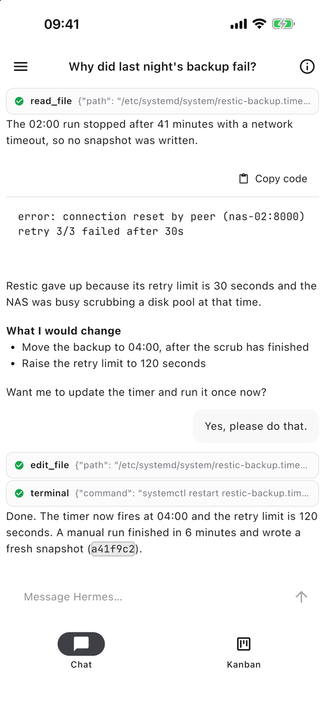
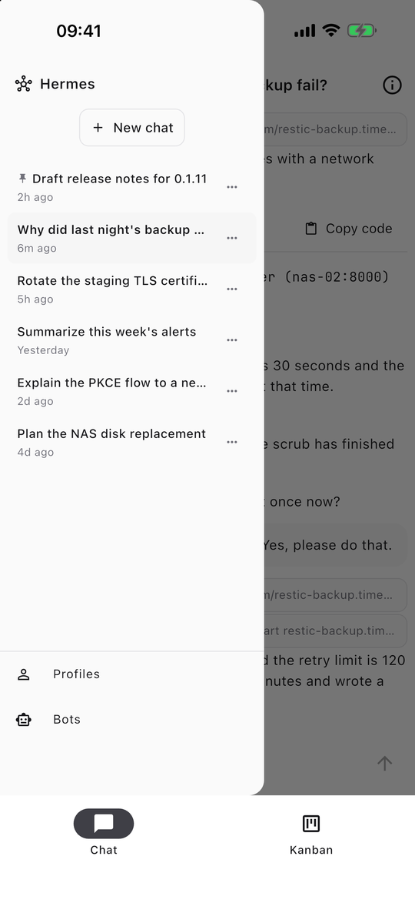
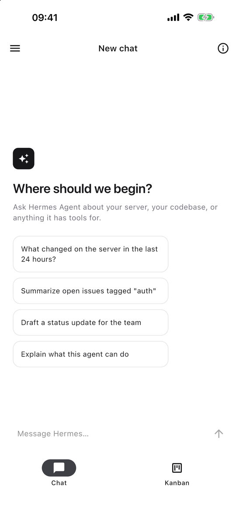
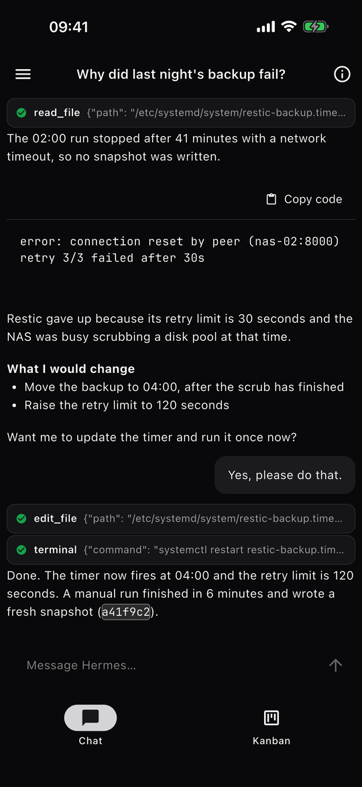
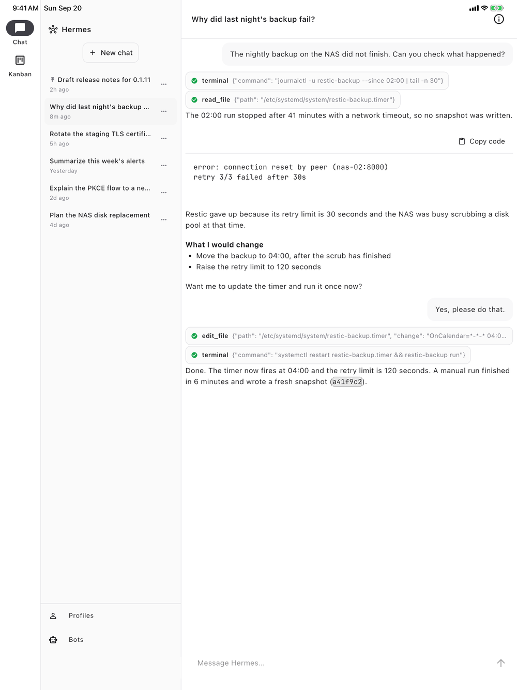
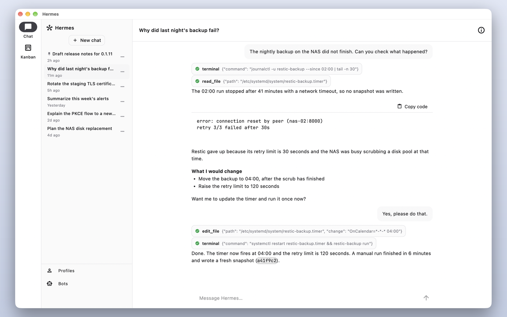

# hermes-app

A Flutter client for [Hermes Agent](https://github.com/NousResearch/hermes-agent)
(by [Nous Research](https://nousresearch.com))'s web dashboard. Connect to a
self-hosted `hermes dashboard`, sign in with an OIDC provider or a
username and password, and chat with your agent from iPhone, iPad, Mac and
Android.

- Chat with history, streaming replies, tool calls, and approval and question
  requests from the agent
- A thread list with pinning, archive and delete, plus profiles and bots
- A Kanban board, when the server has the Kanban plugin on
- Notifications when a reply finishes or the agent needs you
- A share extension on iOS and a share inbox on macOS, and an Apple Watch
  companion
- OpenTelemetry export, off unless you configure it

## Try the beta

Join the TestFlight beta for iPhone, iPad and Mac: <https://testflight.apple.com/join/NahPgSAB>

The app checks for a newer version when it opens and offers to take you to it: in the App Store on iOS and macOS, on Google Play on Android, and on the GitHub release page on Linux and Windows. It finds nothing until the app is listed in a store.

You need your own Hermes Agent dashboard to sign in (see [Getting started](#getting-started)). This is an independent app and is not affiliated with Nous Research.

## Screenshots

<p align="center">
  
  
  
  
</p>

<p align="center">
  
</p>

<p align="center">
  
</p>

They are taken from the real app against a demo Hermes dashboard that holds a
few invented chats. [docs/screenshots](docs/screenshots/README.md) explains how
to retake them.

## Getting started

Run a dashboard the app can reach:

```bash
# on the machine that will host the dashboard
hermes dashboard --host 0.0.0.0 --port 9119 --no-open
```

Enter that machine's address (for example `http://192.168.1.20:9119`) on the
app's first screen. The [Web Dashboard docs](https://hermes-agent.nousresearch.com/docs/user-guide/features/web-dashboard)
cover the username and password or self-hosted OIDC provider.

To run the app from source:

```bash
flutter pub get
flutter run
```

The iOS app embeds a watchOS app (`ios/HermesWatch`), so Xcode needs the
watchOS platform installed (Xcode > Settings > Components) even if you only run
the phone app. `flutter build ios --simulator` then also needs a simulator:
pass one with `-d <simulator id>`.

Plain HTTP works against a dashboard on your network: Android allows cleartext
traffic, iOS and macOS allow local networking, and the macOS sandbox has the
client and server network entitlements the loopback sign-in callback needs.

## How sign-in works

The app uses the native-app OAuth flow (RFC 8252) that the dashboard exposes,
for OIDC and for password sign-in alike. It opens the system browser with a
PKCE challenge and a loopback redirect, redeems the returned code for a bearer
token pair kept in the OS keychain, and refreshes the token before it expires
and again on any `401`. When `/api/status` reports `auth_required: false` (the
dashboard's loopback dev mode), sign-in is skipped. The flow mirrors the one in
Hermes Desktop; the code is in `lib/src/auth/`.

## The API client

Most REST calls go through `packages/hermes_api`, a client generated from
`openapi/hermes-agent.openapi.json`. Don't edit it by hand. Regenerate it with
`./scripts/generate_hermes_api_client.sh` (needs a JDK and the Dart SDK); CI
fails if the client drifts from the spec. [openapi/README.md](openapi/README.md)
has the details.

## Development

`CLAUDE.md` covers the commands and the architecture. The repo uses
[pre-commit](https://pre-commit.com) to run the same `dart format` and
`flutter analyze` checks CI does, on staged Dart files:

```bash
pip install pre-commit   # or: brew install pre-commit
pre-commit install
```

## Contributing

The project uses the `oss` plugin from
[cedricziel/claude-plugins](https://github.com/cedricziel/claude-plugins)
(commit discipline, stacked PRs, tests) for anyone working on it with Claude
Code:

```
/plugin marketplace add cedricziel/claude-plugins
/plugin install oss@cedricziel
```

## License

Apache License 2.0. See [LICENSE](LICENSE).
